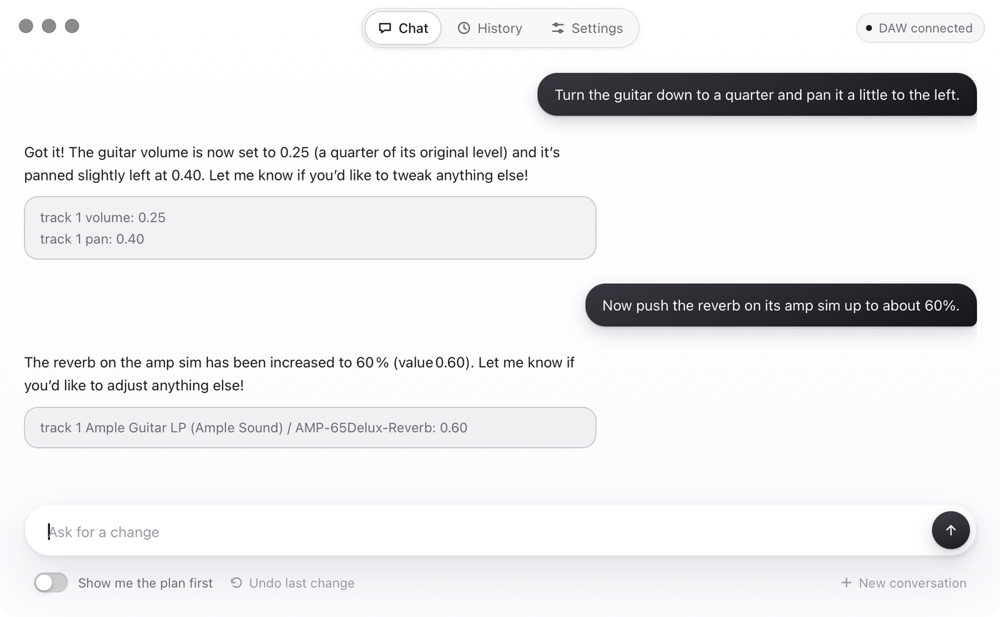

# Tonelab

Natural-language control for your DAW. Say what you want changed, and an
agent finds the track, the plugin and the parameter, changes it, and reports
back what the DAW says the value became.



> "Turn the guitar down to a quarter and pan it a little to the left."
> "Now push the reverb on its amp sim up to about 60%."

## Features

- **Tracks by name.** "Mute the vocals" resolves the track from the project;
  no numbers to look up.
- **Any plugin, no presets.** Effects and their parameters are discovered
  from the DAW at runtime and reached by search, so a 220-parameter amp sim
  works the same as a three-band EQ, and nothing about any plugin is built in.
- **Confirmed, not assumed.** Every change is read back from the DAW; the
  answer reflects what the DAW reports, including a plugin's own rounding.
- **Reversible.** Undo goes straight to the DAW's own history, never through
  the model.
- **Preview first, if you want.** See the planned changes and apply them
  exactly as shown, or let the agent get on with it.
- **Your model, your key.** Any OpenAI-compatible endpoint: a hosted API or
  a local runtime such as Ollama. Keys never leave the backend.
- **Optional web search** for advice that is not in the project, with
  sources cited.

## Supported DAWs

| DAW | Connection | Tracks | Mixer | Plugins | Undo |
|---|---|---|---|---|---|
| REAPER 7 | built-in OSC control surface | yes | volume, pan, mute, solo, sends | discover, read, write | yes |
| Ableton Live 12 | [AbletonOSC](https://github.com/ideoforms/AbletonOSC) remote script | yes | volume, pan, mute, solo, sends | discover, read, write | mixer only |

Adding a DAW means one backend file behind the same interface; everything
above it, including the agent and the window, stays as is.

## Requirements

- macOS 12+, Windows 10+ (WebView2 runtime; present on Windows 11 and on an
  updated Windows 10), or Linux with `libwebkit2gtk-4.1`.
- A supported DAW, set up to send OSC feedback (below).
- An OpenAI-compatible model endpoint with tool calling. Tested with
  `openai/gpt-oss-20b` on Groq and a local 27B model on Ollama.

## Install

Download the build for your platform from
[Releases](https://github.com/winterstim/tonelab-v2/releases).

**macOS:** the app is not signed with an Apple Developer ID. On first launch
Control-click the app and choose Open, or after the first refusal open
System Settings, Privacy & Security, and choose Open Anyway. Once is enough.
Or: `xattr -d com.apple.quarantine Tonelab.app`.

## Set up the DAW

**REAPER:** Preferences, Control/OSC/web, Add, OSC. Set the listening port
to 8000 and the device port to 9000 with host 127.0.0.1. The device port is
off by default, and without it nothing can be read back.

**Ableton Live:** copy AbletonOSC into
`~/Music/Ableton/User Library/Remote Scripts/AbletonOSC`, restart Live, and
pick AbletonOSC as a control surface under Link, Tempo & MIDI. Live's
status bar confirms it is listening on port 11000.

## First run

Tonelab writes `config.json` to your user config directory on first start
(`~/Library/Application Support/tonelab/` on macOS, `%AppData%\tonelab` on
Windows, `~/.config/tonelab` on Linux) and tells you where. Fill in the
model endpoint and, for a hosted one, your key, or do it in Settings. Choose
the DAW backend there too. Then ask for a change.

## Configuration

```json
{
  "llm":    { "base_url": "https://api.groq.com/openai/v1", "api_key": "...", "model": "openai/gpt-oss-20b" },
  "daw":    { "backend": "reaper", "host": "127.0.0.1", "port": 8000, "feedback_port": 9000 },
  "ui":     { "theme": "system", "preview_by_default": false },
  "search": { "provider": "brave", "api_key": "..." }
}
```

`search` is optional: `brave` with a key, or `searxng` with the instance's
`base_url`. Leave the section out to give the agent no web access.

## Development

Requires Go 1.25+, Node, and the [Wails v3 CLI](https://v3.wails.io/getting-started/installation/).

```
wails3 dev                     # run with hot reload
wails3 build                   # build for this machine
wails3 task build:windows      # cross-compile for Windows
wails3 task build:linux        # build for Linux in Docker
wails3 task darwin:package:dmg # universal macOS app and dmg
```

Tests run at three levels. The first needs nothing installed.

```
go test ./...                                   # fakes held to the real backends' contract
go test -tags reaper -count=1 -p 1 ./...        # against a running REAPER
go test -tags ableton -count=1 ./backend/daw    # against a running Live
go test -tags "llm reaper" -p 1 ./backend/app   # the whole thing, with a real model
```

`TONELAB_CONFIG` points the tagged suites at another config file.

## Layout

```
backend/osc      OSC transport and listener, DAW-neutral
backend/daw      DAW command layer: the Client interface and the backends
backend/agent    tools a model can call, and the loop that calls them
backend/search   web search providers
backend/config   the user's settings file
backend/app      the services the window calls
frontend/src     the window
```

## Contributing

See [CONTRIBUTING.md](CONTRIBUTING.md).

## License

[Apache 2.0](LICENSE)
